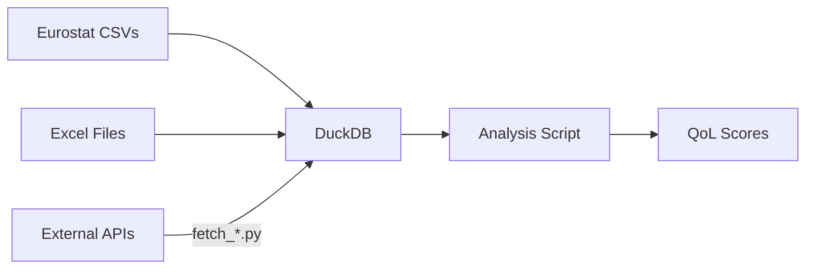

# Quality of Life (QoL) Analysis Plan

## 1. Goal
Calculate a **QoL Score** and **Smart Economy Score** for European cities by integrating:
1.  **Internal Data**: Eurostat (CSV) & Excel files (already in `data.duckdb`).
2.  **External Data**: 
    -   **Air Quality**: Real-time AQI from [AQICN API](https://aqicn.org/api/).
    -   **Amenities**: Green spaces/cultural spots from [OpenStreetMap (Overpass)](https://wiki.openstreetmap.org/wiki/Overpass_API).

## 2. Pipeline Architecture

## 3. Data Integration Strategy

### A. External Data (APIs)
We will add two new modules to `src/`:
-   `src/fetch_aqi.py`: Fetches real-time AQI.
    -   *Indicator*: `API_AQICN_AQI` (Lower is better).
-   `src/fetch_osm.py`: Fetches counts of "Smart" amenities (Coworking spaces, EV charging, Parks).
    -   *Indicator*: `API_OSM_PARKS`, `API_OSM_COWORKING`.

### B. Preprocessing & Imputation
Urban data is often sparse (missing years/cities).
1.  **Forward/Backward Fill**: If 2023 is missing, use 2022.
2.  **Group Imputation**: Fill missing values with the **Country Average** for that year.
3.  **Outlier Removal**: Clip Z-scores > 3.

## 4. Scoring Algorithm

### Smart Economy Score
Weighted average of:
-   **Digital**: `SDG_17_60` (High-speed internet) [30%]
-   **Innovation**: `ISOC_CIEGI_AC` (E-gov usage) [20%]
-   **Education**: `URB_CEDUC` (Higher Ed students) [20%]
-   **Employment**: `URB_CLMA` (Unemployment, inverted) [20%]
-   **Infrastructure**: `API_OSM_COWORKING` (Coworking density) [10%]

### Quality of Life (QoL) Score
Weighted average of:
-   **Health**: `HLTH_RS_BDS1` (Hospital beds) [20%]
-   **Environment**: `API_AQICN_AQI` (Inverted) + Green Areas (Excel) [30%]
-   **Mobility**: `URB_CTRAN` (Public transport share) [20%]
-   **Safety/Social**: `URB_CPOP1` (Depenency ratio) [15%]
-   **Leisure**: `TOUR_OCC_NIM` (Tourism) [15%]

## 5. Execution Plan

1.  **Enhance Schema**: Add API indicators to `dim_indicator`.
2.  **Develop API Fetchers**: Implement `fetch_aqi.py` and `fetch_osm.py`.
3.  **Create Analysis Script (`src/analysis.py`)**:
    -   Load data from DuckDB.
    -   Pivot to Wide format.
    -   Impute missing values.
    -   Normalize (MinMax or Z-Score).
    -   Calculate weighted scores.
    -   Export results to `qol_scores.csv`.

## 6. Next Steps
-   [ ] User must provide AQICN Token.
-   [ ] Run `python src/analysis.py`.

